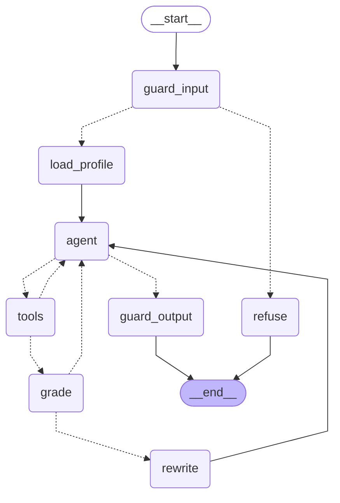

# Grafo do assistente

Gerado por `scripts/draw_graph.py`.

```mermaid
---
config:
  flowchart:
    curve: linear
---
graph TD;
	__start__([<p>__start__</p>]):::first
	guard_input(guard_input)
	refuse(refuse)
	load_profile(load_profile)
	agent(agent)
	tools(tools)
	grade(grade)
	rewrite(rewrite)
	guard_output(guard_output)
	__end__([<p>__end__</p>]):::last
	__start__ --> guard_input;
	agent -.-> guard_output;
	agent -.-> tools;
	grade -.-> agent;
	grade -.-> rewrite;
	guard_input -.-> load_profile;
	guard_input -.-> refuse;
	load_profile --> agent;
	rewrite --> agent;
	tools -.-> agent;
	tools -.-> grade;
	guard_output --> __end__;
	refuse --> __end__;
	classDef default fill:#f2f0ff,line-height:1.2
	classDef first fill-opacity:0
	classDef last fill:#bfb6fc
```
